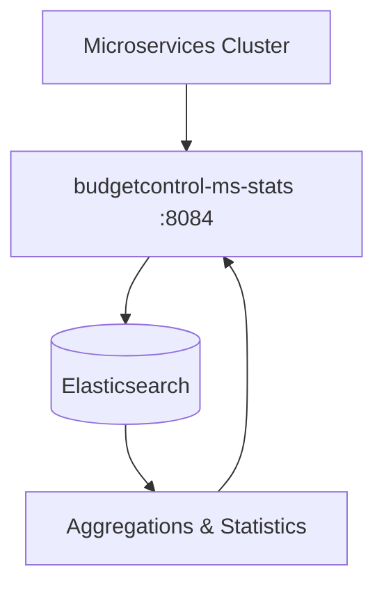
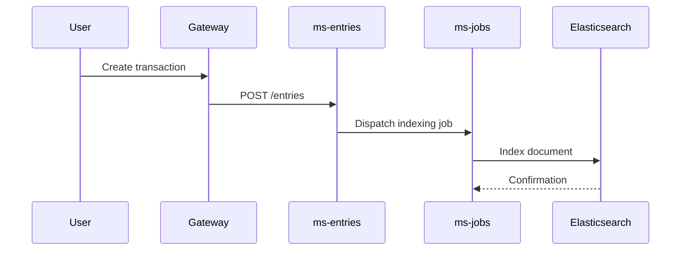

# Elasticsearch

BudgetControl uses **Elasticsearch** as its search and data analytics engine for generating statistics within the application.

## Overview

Elasticsearch is a distributed search and analytics engine based on Apache Lucene. In the context of BudgetControl, it is used by the `budgetcontrol-ms-stats` microservice to aggregate, index, and query users' financial data in order to produce reports and real-time statistics.

## Role in the Architecture

The statistics microservice (`budgetcontrol-ms-stats`, port `8084`) sends and retrieves data from Elasticsearch via aggregation queries. Financial data (income, expenses, budgets, savings, etc.) is indexed in Elasticsearch to enable fast and efficient analytical queries, without putting load on the main PostgreSQL database.

## Use Cases

- **Spending statistics**: calculation of totals, averages, and trends by period (daily, monthly, yearly)
- **Reports by category**: aggregation of transactions by spending or income category
- **Wallet analysis**: wallet balance trends over time
- **Budget vs actual**: comparison between planned budget and actual expenses
- **Savings and goals statistics**: tracking progress toward saving goals and plans

## Configuration

Elasticsearch is deployed as a Docker container within the cluster and is only accessible to internal microservices via the private Docker network.

| Parameter | Value |
|-----------|-------|
| Version | 8.x |
| Internal port | 9200 |
| External access | Not exposed |

## Data Indexing

Data is indexed into Elasticsearch asynchronously via Laravel's **Jobs/Queue** system (`budgetcontrol-ms-jobs`). Whenever an income entry, expense, or financial operation is created or updated, a job is responsible for syncing the corresponding document into the appropriate Elasticsearch index.

