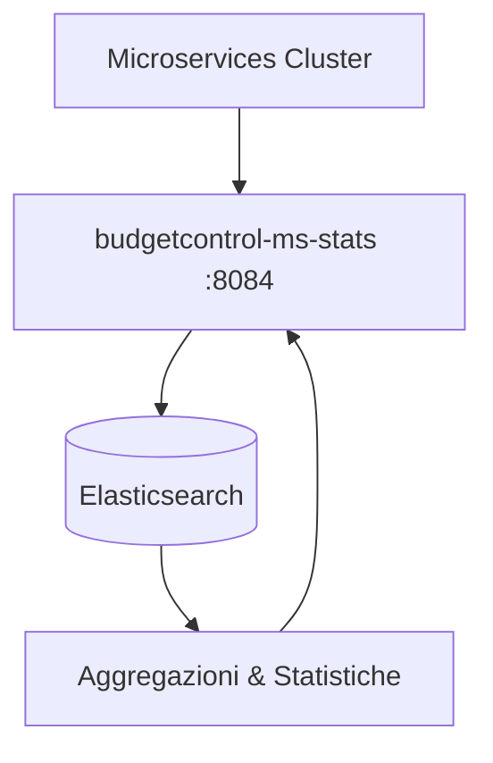
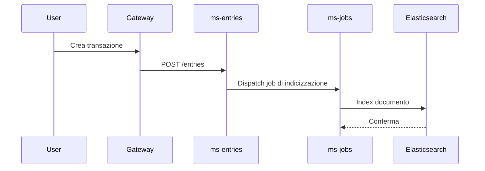

# Elasticsearch

BudgetControl utilizza **Elasticsearch** come motore di ricerca e analisi dei dati per la generazione delle statistiche all'interno dell'applicazione.

## Panoramica

Elasticsearch è un motore di ricerca e analisi distribuito, basato su Apache Lucene. Nel contesto di BudgetControl, viene impiegato dal microservizio `budgetcontrol-ms-stats` per aggregare, indicizzare e interrogare i dati finanziari degli utenti al fine di produrre report e statistiche in tempo reale.

## Ruolo nell'architettura

Il microservizio dedicato alle statistiche (`budgetcontrol-ms-stats`, porta `8084`) invia e recupera i dati da Elasticsearch tramite query di aggregazione. I dati finanziari (entrate, uscite, budget, risparmi, ecc.) vengono indicizzati in Elasticsearch per consentire interrogazioni analitiche rapide ed efficienti, senza gravare sul database PostgreSQL principale.

## Casi d'uso

- **Statistiche di spesa**: calcolo di totali, medie e trend per periodo (giornaliero, mensile, annuale)
- **Report per categoria**: aggregazione delle transazioni per categoria di spesa o entrata
- **Analisi dei wallet**: andamento del saldo dei portafogli nel tempo
- **Budget vs consuntivo**: confronto tra budget pianificato e spese effettive
- **Statistiche sui risparmi e obiettivi**: monitoraggio del progresso verso goal e piani di risparmio

## Configurazione

Elasticsearch è deployato come container Docker all'interno del cluster e comunicato esclusivamente ai microservizi interni tramite la rete Docker privata.

| Parametro | Valore |
|-----------|--------|
| Versione | 8.x |
| Porta interna | 9200 |
| Accesso esterno | Non esposto |

## Indicizzazione dei dati

I dati vengono indicizzati in Elasticsearch in modo asincrono tramite il sistema di **Jobs/Queue** di Laravel (`budgetcontrol-ms-jobs`). Ogni volta che un'entrata, uscita o operazione finanziaria viene creata o aggiornata, un job si occupa di sincronizzare il documento corrispondente nell'indice Elasticsearch appropriato.

