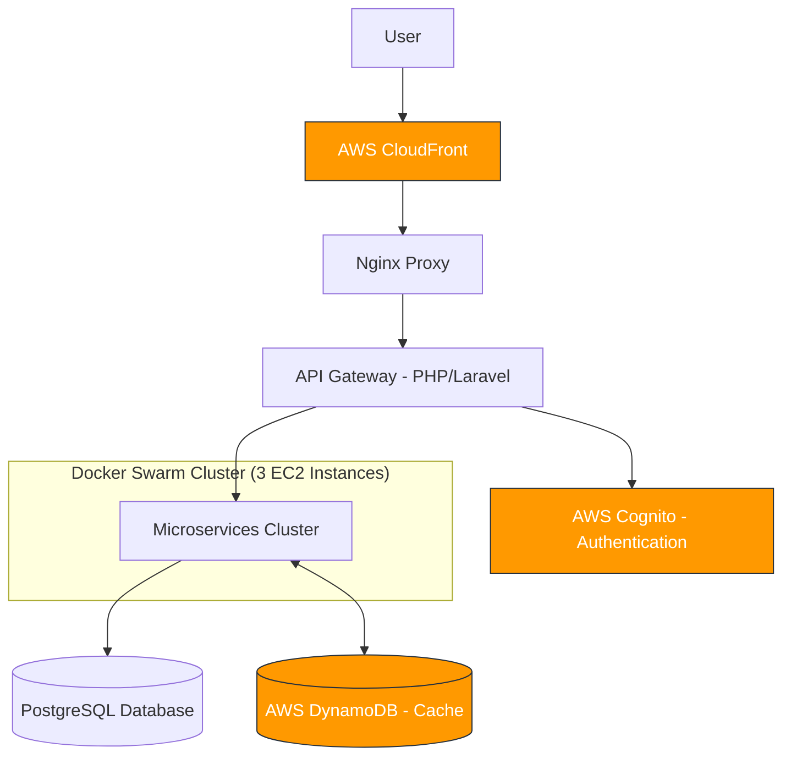

# BudgetControl Infrastructure Overview

This document provides an overview of the BudgetControl application infrastructure, including the technology stack, architecture, and deployment strategy.

## Technology Stack

### Backend (BE)
- **Primary Language**: PHP
- **Framework**: Laravel
- **Specialized Laravel Packages**:
    - Laravel API resources
    - Laravel Passport
    - Laravel Jobs/Queue

### Frontend (FE)
- **Framework**: VueJS
- **SPA Architecture**

## Architecture Diagram

## Infrastructure Components

### AWS Services
- **CloudFront**: Content delivery network and edge caching
- **Cognito**: User authentication and management
- **DynamoDB**: Caching layer
- **EC2**: Hosting Docker containers

### Networking & Routing
- **Nginx Proxy**: Handles SSL termination and request routing
- **API Gateway**: PHP/Laravel application for routing requests to appropriate microservices

### Containerization
- **Docker Swarm**: Container orchestration across 3 EC2 machines
- **Load Balancing**: Traffic distributed across container replicas

## Microservices Architecture

The application is composed of the following microservices, each running in its own Docker container:

| Container Name | Port | Purpose |
|--------------|------|---------|
| budgetcontrol-proxy | 80/443 | Nginx proxy server |
| budgetcontrol-gateway | 8081 | API Gateway |
| budgetcontrol-ms-workspace | 8082 | Workspace management |
| budgetcontrol-ms-authentication | 8083 | Authentication service |
| budgetcontrol-ms-stats | 8084 | Statistics and reporting |
| budgetcontrol-ms-budget | 8085 | Budget management |
| budgetcontrol-ms-entries | 8086 | Financial entries |
| budgetcontrol-ms-wallets | 8087 | Wallet management |
| budgetcontrol-ms-labels | 8088 | Labels management |
| budgetcontrol-ms-searchengine | 8089 | Search functionality |
| budgetcontrol-ms-debt | 8090 | Debt tracking |
| budgetcontrol-ms-savings | 8091 | Savings management |
| budgetcontrol-ms-goals | 8092 | Financial goals |
| budgetcontrol-ms-jobs | N/A | Background job processing |

## Data Flow

1. User requests are routed through AWS CloudFront
2. Nginx proxy handles the incoming requests
3. PHP/Laravel Gateway receives the requests and authenticates via AWS Cognito
4. Gateway routes requests to appropriate microservices
5. Microservices process requests, interacting with PostgreSQL database
6. DynamoDB provides caching capabilities to improve performance

## Container Configuration

All microservices are built from the `mlabfactory/php8-apache:v1.3-xdebug` Docker image, which provides a PHP 8 environment with Apache and XDebug for development purposes.